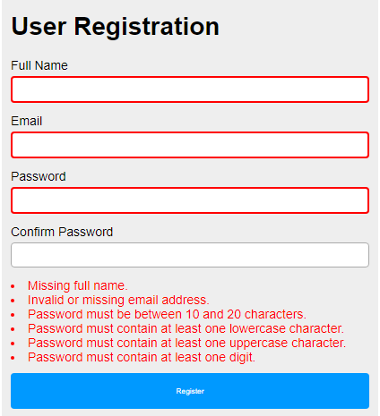

# User-Registration-Lab
User Registration using JavaScript, HTML and CSS

Class: CS 2550 - Web Programming 1

 

Create a registration form that requires 

<ul><li>Full Name </li>
<li>A Valid Email </li>
<li>A Password with:</li>
<ul>
  <li>at least 10 characters.</li>
  <li>one lowercase character</li>
  <li>one uppercase character </li>
  <li>one digit</li>
</ul>  
</ul>
 

Results:

